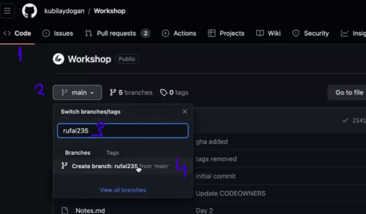
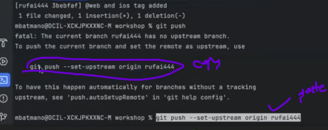
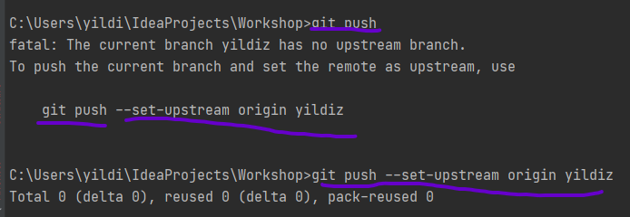
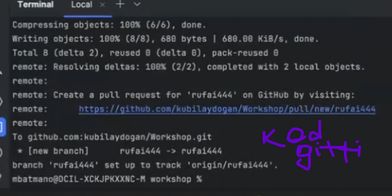
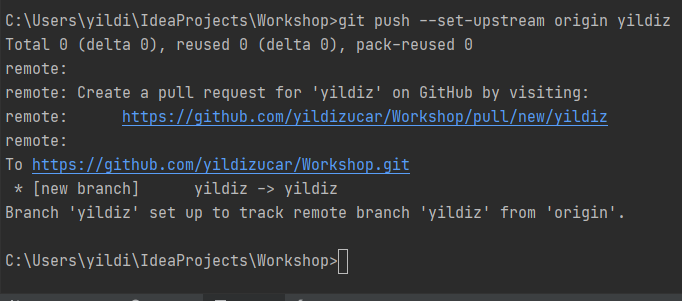
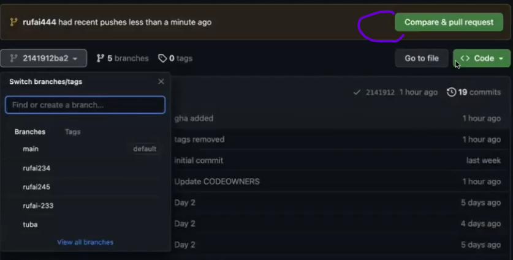
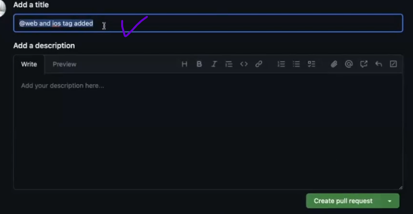
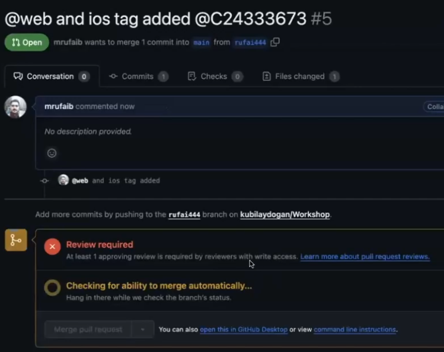
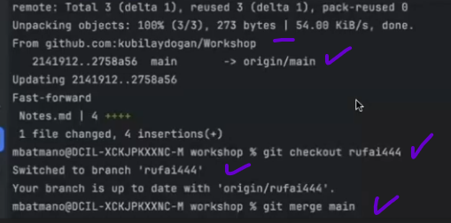

#### GIT

Tren yolu gibi dusun. Bu yolu kopyalayip yan tarafa kendin bir yol aciyorsun ve yolun sonunda birlestiriyorsun.
Birlestirme yapana kadar senin kendi yolunda yaptigin versiyonlari tutan sisteme GIT denir.

#### GIT ten Branch acma

Code gel -> branch ismini yaz-> Create Branch
tikla                                                                                                                                                                 
NOTE= Local ile Remote eslesmedigi zaman bu durum bizi kurtarabilir. Branch grecekten create edilebilir

Terminale geldik 1# git checkout main ===> yazdik . Tren rayini Maine
gecirdim                                                                                                          
2# git branch yildiz ===> branch acabliriz VEYA git checkout -b  ( su an MAin deyim0 )
3# git checkout yildiz ile kendi branchine gecebilirsin           ( su an kendi branchime gectim)

# # GIT STATUS

- mesela bir kacgun gecti hangi dosyalarda ne yaptim onlari gormek icin kullanilabilir
- Veya intellijide Commintslerde de gozukmekte 4# Kendi branchimde dosyalardan bir tanesine @ Tag ekledim mesela ve
  YAPTIGIM DEGISIKLIKLERI GORMEK ICIN Git status yapiyorum
   son degisiklikler bunlar oldu diye gostermekte

BUNU EKLEDIM ==> modified:   ReadMe2.md 4# git  
new file:   ReadMe2.md new file:   img.png git add . ===> ekledk git status ===> son durumu goruyorsun ( 3eklemeye hazir
yesil olanlar ). Artik push yapmaya hazir

      git commit -m " added read me file'  yaziyorsun _ mesaj ne yazmak istersen 

kendi branchimde ve

      git Push yaziyoruz  

bastik gitmedi . Sen tanimiyorum Lokaldemi create ettin bunu (rufai44-evet lkalde create ettik)
Bu goszukmuyor o yuzden bunu tanimlayarak gonder diyor

      git push  --set-upstream origin rufai444

seni tanimiyorum demek bunu kopyalayip yazin basinca kod gider ==> git push --set-upstream origin rufai444

Kod gitti

Gitte compare pull requesti gorebilirsin

veya bir onceki screen shottaki remote yazan mavi linke tiklayabilirsin . Alttaki gibi ekran cikiyor Add a title
istedigini basligi yazabilirsin

bastik ve ekran boyle oldu

### GIT e  birseyler gonderdim , Birisi yorum yapti ve degisiklik yapmam gerek Ne yapmam lazim

       ## Kendi Branchimdayim ve o esnada  baskalari ANA BRANCHA yeni birseyler gonderdi Veya ANA BRANCH UPDATE oldu Tekrar ANA BRANCHA gececegiz  ve uzlerce kisi birselye ana branche gondermis olabilir
        git checkout main

boylece Ana brancha geri geldik

     git pull

bazi degisikliklar olmus gorduk ( notes MD ) de ==> Tekrar kendi branchime geciyorum

     git checkout yildiz

#### Ne yapmaK lazim ( MAIN De ki BUTUN DEGISIKLIKLERI KENDI BRANCHIME ALMAK  LAZIM)

##### 'Maine gittik ==> maini pull yaptik ==> Kendi branchime gectim ==> Maini Yildiz ile eslemem lazim'

     git merge main   ( bazen  cikar  (esc bas wq yaz ve enter )

Main ile Yildiz su an ayni

=======================================================================================================================                                                                                                                                                                                                         
Kendi Branchimizi guncellmek neden onemli Optinal kendi branchinizde isiniz bitene kadar hicbirsey yapmayabilirisniz .
Ara Ara git merge main ile yani Mainin son halini Maine Pull yapip==> Kendi branchine gecip , kendi branchiniz ile
mainin Up to date yapabilrsiniz

                   VEYA 

Kodunuz bitene kadar 2,3 gun calisiyorsunuz kendi branchiniz ile ilgli hersei bitirincede bu islemi yapabilirsiniz
Baskasinin yazdigi bir methodu kullanabilirim belki

soru : Psuh yapmadan cevap : Push yapabilirsiniz kodunuzu . commit yaparsaniz. sonra maine tekrar gidip mainin son
halini pull yapip tekrar push yaptiginiz kendi branchinize gelip ==> git merge main diyebilirsiniz zaten bir degisiklik
varsa o size gelecek

Artik kendi branchiniz uptodate en son degisiklik hali ile commit yapabiliriz. 2 commit yani 

NOTE ==== > Kendi branhimde yukardaki yesil tik isareti kullanarak gecebilirim.
=======================================================================================================================
### @ tag kaldirilsin diye git e yorum birakmislardi - Tag i kaldirdik

           git status
           git add .
           git commit -m "tag removed"
           git push 

