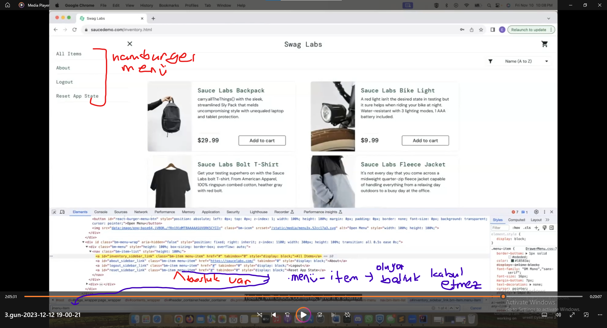

#### GIT

Tren yolu gibi dusun. Bu yolu kopyalayip yan tarafa kendin bir yol aciyorsun ve yolun sonunda birlestiriyorsun.
Birlestirme yapana kadar senin kendi yolunda yaptigin versiyonlari tutan sisteme GIT denir.

#### GIT ten Branch acma

Code gel -> branch ismini yaz-> Create Branch
tikla                                                                                                                                                                 
NOTE= Local ile Remote eslesmedigi zaman bu durum bizi kurtarabilir. Branch grecekten create edilebilir

Terminale geldik 1# git checkout main ===> yazdik . Tren rayini Maine
gecirdim                                                                                                          
2# git branch yildiz ===> branch acabliriz VEYA git checkout -b  ( su an MAin deyim0 )
3# git checkout yildiz ile kendi branchine gecebilirsin           ( su an kendi branchime gectim)

# # GIT STATUS

- mesela bir kacgun gecti hangi dosyalarda ne yaptim onlari gormek icin kullanilabilir
- Veya intellijide Commintslerde de gozukmekte 4# Kendi branchimde dosyalardan bir tanesine @ Tag ekledim mesela ve
  YAPTIGIM DEGISIKLIKLERI GORMEK ICIN Git status yapiyorum
   son degisiklikler bunlar oldu diye gostermekte

BUNU EKLEDIM ==> modified:   ReadMe2.md 4# git  
new file:   ReadMe2.md new file:   img.png git add . ===> ekledk git status ===> son durumu goruyorsun ( 3eklemeye hazir
yesil olanlar ). Artik push yapmaya hazir

      git commit -m " added read me file'  yaziyorsun _ mesaj ne yazmak istersen 

kendi branchimde ve

      git Push yaziyoruz  

bastik gitmedi . Sen tanimiyorum Lokaldemi create ettin bunu (rufai44-evet lkalde create ettik)
Bu goszukmuyor o yuzden bunu tanimlayarak gonder diyor

      git push  --set-upstream origin rufai444

seni tanimiyorum demek bunu kopyalayip yazin basinca kod gider ==> git push --set-upstream origin rufai444

Kod gitti

Gitte compare pull requesti gorebilirsin

veya bir onceki screen shottaki remote yazan mavi linke tiklayabilirsin . Alttaki gibi ekran cikiyor Add a title
istedigini basligi yazabilirsin

bastik ve ekran boyle oldu

### GIT e  birseyler gonderdim , Birisi yorum yapti ve degisiklik yapmam gerek Ne yapmam lazim

       ## Kendi Branchimdayim ve o esnada  baskalari ANA BRANCHA yeni birseyler gonderdi Veya ANA BRANCH UPDATE oldu Tekrar ANA BRANCHA gececegiz  ve uzlerce kisi birselye ana branche gondermis olabilir
        git checkout main

boylece Ana brancha geri geldik

     git pull

bazi degisikliklar olmus gorduk ( notes MD ) de ==> Tekrar kendi branchime geciyorum

     git checkout yildiz

#### Ne yapmaK lazim ( MAIN De ki BUTUN DEGISIKLIKLERI KENDI BRANCHIME ALMAK  LAZIM)

##### 'Maine gittik ==> maini pull yaptik ==> Kendi branchime gectim ==> Maini Yildiz ile eslemem lazim'

     git merge main   ( bazen  cikar  (esc bas wq yaz ve enter )

Main ile Yildiz su an ayni

=======================================================================================================================                                                                                                                                                                                                         
Kendi Branchimizi guncellmek neden onemli Optinal kendi branchinizde isiniz bitene kadar hicbirsey yapmayabilirisniz .
Ara Ara git merge main ile yani Mainin son halini Maine Pull yapip==> Kendi branchine gecip , kendi branchiniz ile
mainin Up to date yapabilrsiniz

                   VEYA 

Kodunuz bitene kadar 2,3 gun calisiyorsunuz kendi branchiniz ile ilgli hersei bitirincede bu islemi yapabilirsiniz
Baskasinin yazdigi bir methodu kullanabilirim belki

soru : Psuh yapmadan cevap : Push yapabilirsiniz kodunuzu . commit yaparsaniz. sonra maine tekrar gidip mainin son
halini pull yapip tekrar push yaptiginiz kendi branchinize gelip ==> git merge main diyebilirsiniz zaten bir degisiklik
varsa o size gelecek

Artik kendi branchiniz uptodate en son degisiklik hali ile commit yapabiliriz. 2 commit yani

NOTE ==== > Kendi branhimde yukardaki yesil tik isareti kullanarak gecebilirim.
=======================================================================================================================

### @ tag kaldirilsin diye git e yorum birakmislardi - Tag i kaldirdik

           git status
           git add .
           git commit -m "tag removed"
           git push 

#### MAIN BRANCHE yanlilikla birseyler ekledin ve eski haline almak istiyorusn

 reset yaptin O Maindeki herseyi gider . Kendi branhimize birsey olmaz . Artik kendi branchine
gecebilirsin

===========================>1. SAAT KODLARA GECTIK =======================

class oldugu zaman . ile yazabiliriz

===> driver.findelEments===> List<WebElement> donuyor bize

ohalde ben List < WebElemnt > olarak yazabilirim

Burda da kactane oldugunu size ile yaziyorum karsisinda zaten int yaziyor , bizede return typye int olucakti

Dropdown'da ==> findElemnts (s ) ile bulabiliriz . O yuzden bu list aslinda methoda int oldugu icin bize return type int
ile ilgili olmalidir.  
screendekilerin hepsi LIST ile ilgli komutlar. LIST cretae edersen kullanabilecek butun methodlari veriyor

     Then verify 6 product are listed on Products Page

     @Then("verify {int} product are listed on Products Page")
    public void verifyProductAreListedOnProductsPage(int count ) {      // parametreye count dedik . Urunlein sayisi gelecek cunku
     assertEquals(count ,pages.productsPage().getCountOfPruducts());   // verify dedigi icin once iki degeri karsilastirma var  actual ve expectedt
                                                                       //Expected furuden gelen deger (6) ama count olarak parametre yaxdik
    }

    }

        public int getCountOfPruducts() {
        List<WebElement> product = driver.findElements(By.cssSelector(".inventory_item"));
        return product.size();
    }

          VEYA TEK SATIR ILEDE BOYLE YAZABILIRIZ
          NOTE = EKRAN GORUNTUSU ASAGIDA VAR

          
       public int getCountOfPruducts() {
        return  driver.findElements(By.cssSelector(".inventory_item")).size();
    }

}

Bazi firmalar 134 line bazilari 132 line gibi isteyebiliyor (SCREENSHOOTA BAK)

##### Interview sorusu = Seleniumda  Dropdown konusunu handle yapan CLASS? - DropDown menulerini hangi sekillede kac degisik yoldan secebilirsin

        And verify that sort dropdown has this options
      | Name (A to Z)       |
      | Name (Z to A)       |
      | Price (low to high) |
      | Price (high to low) |

                   }
          @And("verify that sort dropdown has this options")
          public void verifyThatSortDropdownHasThisOptions(List<String>options ) { // 12-15 arasi data table var .stepdef create yapilinca 1. oncelik parametrelere isim vermek lazim -->(List<String>options )
          pages.productsPage().verifySortDropDownOptions(options);              //assert ile yapilabilir yukardaki gibi farkli bir yontem deneyelim dedik2
                                                                                /burada benim methodum -verifySortDropDownOptions- Dropdown da yazili olanlara bakacak ve Options parametresi ile karsilastiracak
                                                                               //assertEquals(count ,pages.productsPage().getCountOfPruducts());    // buna benzerde yapabiliriz dedi aslinda ama farkli bir yol denedik

                                                                            //Bazi firmalar 134 line bazilari 132 line gibi isteyebiliyor
                                                                            }

                                                                                 }

       public void verifySortDropDownOptions(List<String> options) {
        // dropdown konusunu handle yapan class - DropDown menulerini hangi sekillerde kac degisik yoldan secebilirsin
        //select class ile -visible .option.

        WebElement dropdown = driver.findElement(By.xpath("//select[@class ='product_sort_container'] "));
        Select select = new Select(dropdown);
        List<WebElement> content = select.getOptions();  //iki seyi karsilastirmam lazim . DropDowndakileri bulmam lazim  ve bunu Feature Fileden gelen  Stingden olusan listim ile karsilastirmam lazim
        List<String> text = new ArrayList<>();            // 2 Ayni dataType karsilastirmam lazim. Bana Featuredan List string gelmis.Su an elimizde WebElementleden olusan bir liste var
        for (WebElement each : content) {               //Burada da ListOf Stringe cevirmem gerekli
            text.add(each.getText());                    //applicarindaki nametto z falan yazan yerdeki isimleri alamam gererkli,Bunlari alip Featiredeki liste ile karsilastirabileyim

        }                                               //WebElelmntelrden olusan bir list var bunlarin gettext lerini almam lazim
        assertEquals(options, text);                    //Text listini, contentden Textleri alip text dizisine atmam lazim
    }                                                    //soru contenteki web elemnetlerdeki textleri alip nasil text e ekleyebilirim
                                                     //Amac =text listine  her bir Webelementin getText ile textini  aliyor ve 84 deki textimize ekliyri

}

Select Class ile - visible , value option.. Selec clasii hemen import yapiyoruz

Screeen shotta WEB ELEMENT yaz diyor parantezde

Select Class import ettikten sonra select . ===> yazdigin zaman select objem imkanlri asagida

getoptions() ---> bir list veriyor

              List<WebElement> content = select.getOptions();

List verdigi icin basina bir List < WebElement > yaziyoruz

========= Alttaki Screenshotin aciklamasini yukari yapistirdim

