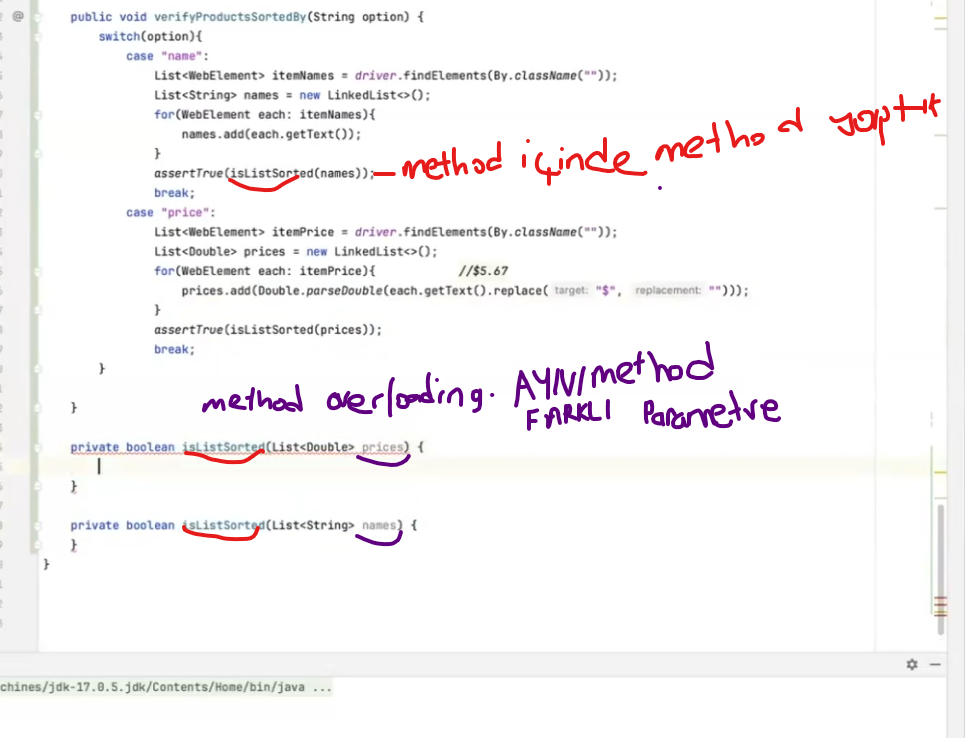

         IKI TURLUDE GOSTEREBILIR 

```java 

Scenario: Validate various elements
          And verify hamburger menu contains
1-YOL=    | All Items       |
          | About           |
          | Logout          |
          | Reset App State |
         And verify hamburger menu contains following submenus
2-YOL=    | All Items, About, Logout, Reset App State |

```
1-  YOLDA  LIST ILE YAPTIK , =Stringlerden olusan ii liste yaptik karsilastirdik .Day 3
2-  YOLDA ,| All Items, About, Logout, Reset App State | burdakilerin hepsi syring 


```java
public String getHamburgerMenu2() {
wait.until(ExpectedConditions.visibilityOfAllElements(driver.findElements(subMenus)));
List<WebElement> menu = driver.findElements(subMenus);
List<String> subMenus = menu.stream().map(WebElement::getText).collect(Collectors.toList());

        String output = "";
        for (String each : subMenus) {
            output += each + ", ";
        }
        output = output.substring(0, output.length() - 2);//| All Items, About, Logout, Reset App State | sondaki bosluk ve vigulu kaldiriyor
        return output;

        // or

        // return subMenus.stream()
        //        .map(String::valueOf)
        //        .collect(Collectors.joining(", "));
    }

```
#### SWITCH CASE YONTEMI ILE FAETUREDAKI IKI FARKLI PARAMETREYI COZMEK 
```java

                Scenario: Validate sort options
                When user sort the items by "Name (A to Z)"
     BURASI     Then verify that items are sorted by "name"
                When user sort the items by "Price (low to high)"
     BURASI     And verify that items are sorted by "price"


public void verifyProductsSortedBy(String option) {
        switch (option) {
          case "name":
              List<WebElement> itemNames = driver.findElements(By.className("inventory_item_name"));
              List<String> names = new LinkedList<>();
                      for (WebElement each : itemNames) {
                          names.add(each.getText());
                           }
                           assertTrue(isListSorted(names));
             break;
          case "price":
              List<WebElement> itemPrice = driver.findElements(By.className("inventory_item_price"));
              List<Double> prices = new LinkedList<>();
                     for (WebElement each : itemPrice) {            //$5.67
                      prices.add(Double.parseDouble(each.getText().replace("$", "")));
                        }
                        assertTrue(isSorted(prices));
             break;
             }

        }
```
YOL = name olabilir price olabilir . option yazalim switsh ve sacelere yazariz

         public void verifyProductsSortedBy(String option) {
            switch (option) {
            case "name":
                //...//KOD 
               break;
            case "price"
                //...//KOD    
                break;


listin SORT OLUP OLMADIGINI NASIL  KONTROL EDEBILIRIZ


### Click -switch methodu -Idler atni 2 yol ( benim notum-day 4 )
```java
         private static boolean isListSorted(List<String> list) {  // alttaki method ile overloading oldu ayni method farkli parametre
         List<String> copy = new LinkedList<>(list); //LIST PARANTEZ ICINE YAZINCA 2 .BIR LISTI KOPYALAR
         Collections.sort(copy);  //LISTEM SORTED ISE HIC BIR DEGISIKLIK OLMAZ. ZATEN SIRALI ISE BIR DAHA DEGISMEZ
           return list.equals(copy);  //list.equals(copy) ILE IKI LISTENIN SIRALI OLUP OLMADIGINI KONTROL EDIYORUZ
      }
1-2-4-5-3 list  88 deki list  (List<String> list)
1-2-4-5-3 copy   90 sort yaptim Collections.sort(copy);
1-2-3-4-5 copy    karsilastir ve sirali degilse false  

### Click -switch methodu -Idler atni 2 yol ( benim notum-day 4 )

```java

@And("clicks on {string} button 2")
public void clicksOnButton2(String button){
        switch(button.toLowerCase()){
        case"checkout":
        pages.shoppingCartPage().clickOnCheckoutButton();
        break;
        case"continue":
        pages.shoppingCartPage().clickOnContinueButton();
        break;
        case"finish":
        pages.shoppingCartPage().clickOnFinishButton();
        break;
        }
        }

// or

@And("clicks on {string} button")
public void clicksOnButton(String buttonName){
        pages.shoppingCartPage().clickOnButton(buttonName);
        }

```

methodlar

```java
 public void clickOnCheckoutButton(){
        // driver.findElement(checkout).click();
        wait.until(ExpectedConditions.elementToBeClickable(checkout)).click();
        }

public void clickOnContinueButton(){
        wait.until(ExpectedConditions.elementToBeClickable(continueButton)).click();
        }

public void clickOnFinishButton(){
        wait.until(ExpectedConditions.elementToBeClickable(finish)).click();
        }

//OR

public void clickOnButton(String button){
        wait.until(ExpectedConditions.elementToBeClickable(By.id(button.toLowerCase()))).click();//burada paramatirze yaptik
        }
```


####yeni step
  AAsagidaki DataTable  bir map ==> firstanme Key , Random  Value 
 bu yuzden bunu bir Map e cevirmemiz lazim
```java
 And user enters checkout information
      | firstName | random |
      | lastName  | random |
      | zipCode   | random |

```

Map<String, String> info ===> Key ve value bir string cunku . faeture file da yazan bu
               
             Map<String, String> info = dataTable.asMap();

boyle yazarak ==> featureda yazili olani, map e donusturduk
# ID locator kontrol etme ==> #firstname==> # bu isareti basina koy inspecte 

