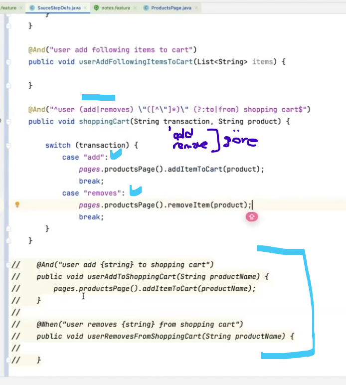
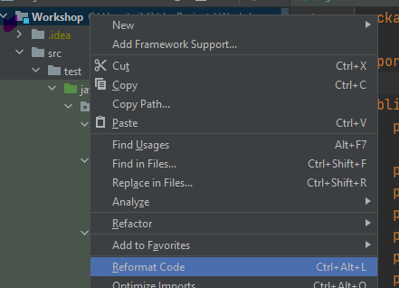
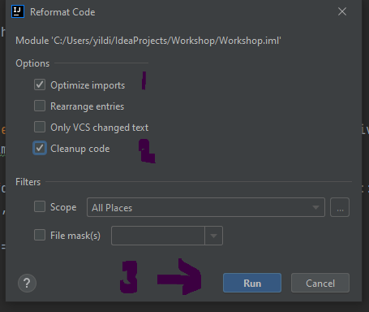
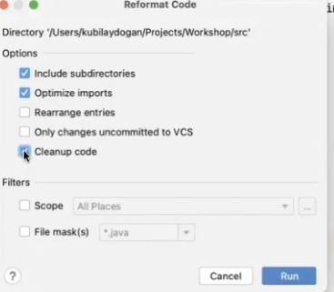

LoginPage.java classda = //OVERLOADING = Ayni method ismi farkli paramatreler ==> public void login
public void login(String username, String password)
public void login(String username)
public void login()
public void login(DataTable dataTable)

## ' DataTable'
Features da bu sekilde senaryo varsa : DataTable olarak cretae ediyor                              
Scenario: Login With Valid Credentials                                                                                                             
Given user login to the website                                                                                                                          
| username | standard_user |                                                                                                                                              
| password | secret_sauce  |           

@When("user login to the website")                                                                                                                                                                    
public void user_login_to_the_website(DataTable dataTable) {                                                                                                                     
pages.loginPage().openLoginPage();                                                                                                                               
pages.loginPage().login(dataTable);

}
#NOT = Data Table da Neden MAP 
DataTable gordugun zaman Map kullanman gerektigini hatirla 
Neden Map kullaniyoruz cunku : Asagidaki bilgiler KEY and VALUE  dolayisi ile burda map var 
| username | standard_user |                                                                                                                                              
| password | secret_sauce  |

// MAP de VALUE  okumak istiyorsam Get(key ) kullaniyoruz aslinda

LoginPage.java classda                                                               
Map<String, String> credentials = dataTable.asMap();
// driver.findElement(usernameField).sendKeys(credentials.get("username"));
// driver.findElement(passwordField).sendKeys(credentials.get("password"));
// driver.findElement(passwordField).sendKeys(credentials.get("password"), Keys.ENTER); ==> CLIK gorevini yapiyor oyuzden ekledik 

Assertions. assertTrue( diger equalsda gecerli). IMPORT yapinca bir daha Assertions yazmaya gerek yok 
// assertTrue(driver.getTitle().contentEquals("Swag Labs"));
// assertEquals("Swag Labs", driver.getTitle());  once actual value , sonra excpected value                                                                                                                                         
*** assertEquals ===> once actual value , sonra excpected value 
---------------------------------------------------
####  And verify title is "Swag Labs" in "Products" page
   Page olurse ,  Bu  stepte iki tane parametre var cunku  "y " sayfasina gitti "shopping "page gitti diyelim 
    burdada Switch methodu kullanabilirim

@Then("verify title is {string} in {string} page")
public void verify_title_is_in_page(String title, String page) {

        switch (page.toLowerCase()) {
            case "product":
                pages.productsPage().verifyTitle(title);
                break;
            case "shopping":
                pages.shoppingCartPage().verifyTitle(title);
        }
    }

  -   // verify_title_is("Swag Labs");  ==> bu su demek 69 ine aslinda bir method.Sadece bunu yazarak  kullananbilrim. YANI step def, baska bir step def cagirabiliyoruz 

####  Scenario Outlinne kullaniminad EXAMPLES olmak zorunda  
Scenario Outline : Bir testin birden fazla  DATA lar ile calistilmasi durumunda kullanilir
 VERIFY ile 3 farkli yontem ile cozumu  var asagida .

Scenario Outline: Login With Invalid Credentials
Given user login to the website
| username | standard_user |
| password | 1234          |
Then verify the "Username and password do not match any user in this service" in login page
* verify the "<error_message>" in login page
* verify the "<error_message>" in "< page >" page

    Examples:                                                                                                                                                                       
      | **error_message**                                           | **page ** |                                                                                                             
      | Username and password do not match any user in this service | login    |

-- verify the "<error_message>" in login page 
    Burda  -- "<error_message>"  sen ne yazarsan iceri onu kontrol edecek (error message yerine)                                                                                        

-- verify the "<error_message>" in "< page >" page                                                                                                                                            
   bu stepi yazmak daha mantikli paramatirize etmis oluyoruz . Cunku her zaman kullanabiliriz ( switchde oldugu gibi)
     
yani birsuru step def yazamkatansa tek bir yere toplayabiliriz- switch ile

    @Then("verify the {string} in {string} page")
    public void verify_the_in_page(String message, String page) {
        switch (page.toLowerCase()) {
            case "login":
                pages.loginPage().verifyErrorMessage(message);
                break;
        }
    }

####  Urunlerin eklenemsi ve STRING FORMAT KULLANIM ornekleri 
1)) Tek urun ekledigin zaman 

 And User add" Sauce Labs Fleece Jacket " to shopping cart 
 step defi 
@Then("user add {string} to  shopping cart ")
public void userAddToShoppingCart ( String productName ) {
 pages.productsPage().addItemToCart(productName);
}

* ' addItemToCart methodum-BURDAKI OLAY URUNUN OLDUGU YERE CLICK YAPMAK ''
public void addItemToCart(String productName) {

        // option 1
        // String product =  String.format("//div[text()='%s']/../../following-sibling::div/button", productName);
        // driver.findElement(By.xpath(product)).click();

        // option 2
        // String product = String.format(addToCartButtonTemplate, productName);
        //driver.findElement(By.xpath(product)).click();
        // wait.until(ExpectedConditions.elementToBeClickable(By.xpath(product))).click();

        // option 3
        // String product = "//div[text()='" + productName + "']/../../following-sibling::div/button";
        // driver.findElement(By.xpath(product)).click();

        // option 4
        // driver.findElement(By.xpath("//div[text()='" + productName + "']/../../following-sibling::div/button")).click();

        // option 5
        String product = String.format(addToCartButtonTemplate, productName);
        WebElement addToCartButton = driver.findElement(By.xpath(product));
        click(addToCartButton, ClickType.JSEXECUTOR);
        // clickWithJS(addToCartButton);

        log.info("{} is added to shopping cart", productName);

    }

 
Xpath Aldik ==> //div[text()='Sauce Labs Fleece Jacket']/../../following-sibling::div/button
            ==> Bu benim variabelim "Sauce Labs Fleece Jacket" buraya %s koyuyorum
            ==> Option 1 de  
        String product =  String.format("//div[text()='%s']/../../following-sibling::div/button", productName); 
        parametredeki productName , %S nin icine koyucak

2)) COK  urun ekledigin zaman
TETS CASE , Urunleri sec, 1 tanesini sil (remove) , add to cart 3 dogru sayi verify yap 

Scenario Outline: Validate shopping cart

    Given user login as "standard_user"
    When user add "Sauce Labs Fleece Jacket" to shopping cart
    And user add "<item1>" to shopping cart
    And user add following items to cart
      | <item2>           |
      | <item3>           |
      | Sauce Labs Onesie |
    When user removes "<item3>" from shopping cart
    Then verify shopping cart contains 4 item

    Examples:
      | item1                   | item2               | item3                 |
      | Sauce Labs Bolt T-Shirt | Sauce Labs Backpack | Sauce Labs Bike Light |

toplu urun kullanildigi icin ==> Data Table kullanimi yaptik item 1,2,3,
remove yapildi , son stepte verify kismi var 
 TERCIH = Scenario OutLine kullandik  AMA  urunleri
| Sauce Labs Onesie | direk boylede yazabilirdik  itemlarin yerine 
alttaki eranda oldugu gibi transaction add ve remove gore yapiyor add|remove  ile bir paramatreye donustu
2 parametre isim adi zaten buda product 
? bunlarin onemsiz oldugunu gosteriyor 

============================GITE GONDERMEDEN ONCE FORMAT ATMA ==============

Bosta yazlil olan import vs varsa siliyor 
Mac icin 
